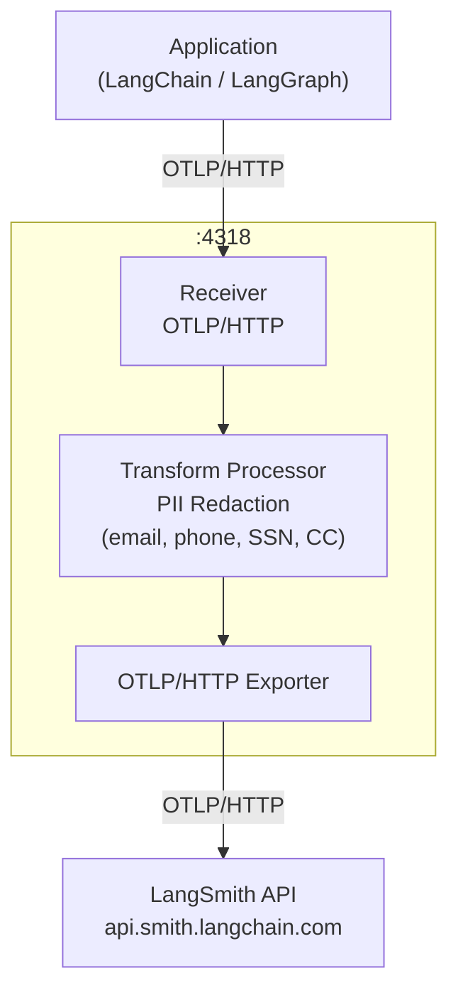

[LangChain](/langsmith/trace-with-langchain) and [LangGraph](/langsmith/trace-with-langgraph) applications support [OpenTelemetry-based tracing](/langsmith/trace-with-opentelemetry). Instead of sending traces directly to LangSmith, you can route them through an OpenTelemetry collector you control, apply redaction rules to strip sensitive fields, and forward the sanitized traces to LangSmith.

Traces flow from your application to the collector over OTLP/HTTP. The collector runs a transform processor that redacts sensitive span attributes, such as prompt inputs and model completions, before forwarding the sanitized spans to the LangSmith API.



## Prerequisites

Both of the following approaches require the following environment variables. Set `OTEL_EXPORTER_OTLP_ENDPOINT` to the address of your collector:

```bash
LANGSMITH_OTEL_ENABLED="true"
LANGSMITH_TRACING="true"
LANGSMITH_OTEL_ONLY="true"
LANGSMITH_PROJECT="my-project"
OTEL_EXPORTER_OTLP_ENDPOINT="http://<my-otel-collector-endpoint>:4318"
```

For more on `LANGSMITH_PROJECT`, refer to [Log traces to a specific project](/langsmith/log-traces-to-project).

## Configure the collector

Both approaches also require an OpenTelemetry collector running as an intermediary between your application and LangSmith. The following configuration sets up an OTLP receiver on port `4318`, a transform processor that redacts the `gen_ai.prompt` and `gen_ai.completion` span attributes, and an exporter that forwards the sanitized traces to the LangSmith API:

```yaml
receivers:
  otlp:
    protocols:
      http:
        endpoint: 0.0.0.0:4318


processors:
  transform/redact:
    error_mode: ignore
    trace_statements:
      - context: span
        statements:
          - replace_pattern(attributes["gen_ai.completion"], "[\\s\\S]*", "[REDACTED]")
          - replace_pattern(attributes["gen_ai.prompt"], "[\\s\\S]*", "[REDACTED]")

exporters:
  otlphttp/langsmith:
    traces_endpoint: "https://api.smith.langchain.com/otel/v1/traces"
    headers:
      x-api-key: "${env:LANGSMITH_API_KEY}"
      Langsmith-Project: "${env:LANGSMITH_PROJECT}"


service:
  pipelines:
    traces:
      receivers: [otlp]
      processors: [transform/redact]
      exporters: [otlphttp/langsmith]
```

## Trace with LangChain or LangGraph

Use this approach if your application already uses [LangChain](/langsmith/trace-with-langchain) or [LangGraph](/langsmith/trace-with-langgraph). The tracing integration handles span creation automatically based on your environment variables, so no additional instrumentation code is required:

```python
from langchain.agents import create_agent
from langchain.tools import tool
from langchain_openai import ChatOpenAI


@tool
def tell_joke(topic: str) -> str:
   llm = ChatOpenAI()
   response = llm.invoke(f"Tell me a short, funny joke about {topic}.")
   return response.content


agent = create_agent(
   model=ChatOpenAI(),
   tools=[tell_joke],
   system_prompt="When the user asks for jokes, use the tell_joke tool for each topic.",
)


topics = ["programming", "python", "kubernetes", "machine learning"]


result = agent.invoke(
   {"messages": [{"role": "user", "content": f"Tell me jokes about these topics: {', '.join(topics)}"}]}
)


print(result["messages"][-1].content)
```

## Trace with the OpenTelemetry SDK directly

Use this approach if you need programmatic control over the tracer provider and exporter. For example, to set per-request project names or configure custom headers at runtime. You configure the provider explicitly in code rather than relying on environment variables alone:

```python
import os

from langchain.prompts import ChatPromptTemplate
from langchain_openai import ChatOpenAI
from opentelemetry import trace
from opentelemetry.exporter.otlp.proto.http.trace_exporter import OTLPSpanExporter
from opentelemetry.sdk.trace import TracerProvider
from opentelemetry.sdk.trace.export import BatchSpanProcessor


project_name = os.environ["LANGSMITH_PROJECT"]
otlp_endpoint = os.environ["OTEL_EXPORTER_OTLP_ENDPOINT"]


provider = TracerProvider()
provider.add_span_processor(
   BatchSpanProcessor(
       OTLPSpanExporter(
           endpoint=otlp_endpoint+"/v1/traces",
           headers={"Langsmith-Project": project_name},
       )
   )
)
trace.set_tracer_provider(provider)


chain = ChatPromptTemplate.from_template("Tell me a joke about {topic}") | ChatOpenAI()


for topic in ["programming", "python", "databases", "kubernetes", "machine learning"]:
   print(f"Asking about {topic}...")
   result = chain.invoke({"topic": topic})
   print(f"  {result.content[:100]}\n")


provider.force_flush()
provider.shutdown()
```

<Note>
If you prefer to redact sensitive data without routing through a collector, see [Prevent logging of sensitive data in traces](/langsmith/mask-inputs-outputs).
</Note>

---

<div className="source-links">
<Callout icon="edit">
    [Edit this page on GitHub](https://github.com/langchain-ai/docs/edit/main/src/langsmith/otel-gateway-trace-redaction.mdx) or [file an issue](https://github.com/langchain-ai/docs/issues/new/choose).
</Callout>
<Callout icon="terminal-2">
    [Connect these docs](/use-these-docs) to Claude, VSCode, and more via MCP for real-time answers.
</Callout>
</div>
