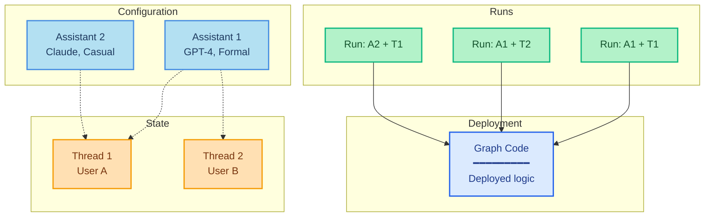

A _run_ is an invocation of an [assistant](/langsmith/assistants). When you execute a run, you specify which assistant to use—either by graph ID for the default assistant, or by assistant ID for a specific configuration.

This diagram shows how a **run** combines an assistant with a thread to execute the graph:

- **Graph** (blue): The deployed code containing your agent's logic
- **Assistants** (light blue): Configuration options (model, prompts, tools)
- **Threads** (orange): State containers for conversation history
- **Runs** (green): Executions that pair an assistant + thread

**Example combinations:**
- **Run: A1 + T1**: Assistant 1 configuration applied to User A's conversation
- **Run: A1 + T2**: Same assistant serving User B (different conversation)
- **Run: A2 + T1**: Different assistant applied to User A's conversation (configuration switch)

When executing a run:

- Each run may have its own input, configuration overrides, and metadata.
- Runs can be stateless (no thread) or stateful (executed on a [thread](/langsmith/use-threads) for conversation persistence).
- Multiple runs can use the same assistant configuration.
- The assistant's configuration affects how the underlying graph executes.

The Agent Server API provides several endpoints for creating and managing runs. For more details, refer to the [API reference](/langsmith/server-api-ref).

## In this section

<CardGroup cols={2}>
  <Card title="Kick off background runs" icon="player-play" href="/langsmith/background-run">
    Run your agent asynchronously and poll for results.
  </Card>
  <Card title="Run multiple agents on the same thread" icon="messages" href="/langsmith/same-thread">
    Use multiple assistants on a shared thread to combine agent capabilities.
  </Card>
  <Card title="Stateless runs" icon="player-skip-forward" href="/langsmith/stateless-runs">
    Execute runs without persisting state when conversation history isn't needed.
  </Card>
  <Card title="Cancel a run" icon="player-stop" href="/langsmith/cancel-run">
    Cancel a single run or multiple runs via the API.
  </Card>
</CardGroup>

---

<Callout icon="edit">
    [Edit this page on GitHub](https://github.com/langchain-ai/docs/edit/main/src/langsmith/runs.mdx) or [file an issue](https://github.com/langchain-ai/docs/issues/new/choose).
</Callout>
<Callout icon="terminal-2">
    [Connect these docs](/use-these-docs) to Claude, VSCode, and more via MCP for real-time answers.
</Callout>

