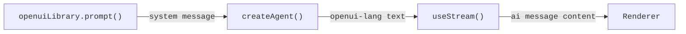

[OpenUI](https://github.com/openuidev) is a generative UI library that lets a language model produce complete, interactive UIs in a declarative format called **openui-lang**. Instead of returning a chat message, the agent returns a component tree with cards, charts, tables, tabs, and forms that the `Renderer` turns into a real React UI.

This integration is well-suited for data-rich outputs like reports, dashboards, and data explorers, where the model is both the data analyst and the UI designer.

import { ExampleEmbed } from "/snippets/example-embed.jsx"

<ExampleEmbed example="openui" minHeight={700} />

## How it works

1. **Generate the system prompt:** call `openuiLibrary.prompt()` once at startup; it produces a complete openui-lang reference that the model uses to write valid component trees
2. **Inject on first message:** send the system prompt as the opening system message when a new conversation starts
3. **Model writes openui-lang:** the model responds with a program like `root = Stack([header, kpis, chart])` instead of prose
4. **Render with `Renderer`:** pass the text to OpenUI's `Renderer` and the component library; it parses and renders the tree



## Installation

```bash
npm install @langchain/react @openuidev/react-ui @openuidev/react-headless @openuidev/react-lang
```

<Tip>
OpenUI requires React 19+ and [`zustand`](https://www.npmjs.com/package/zustand). The frontend code is React-only; the LangGraph agent backend can be written in TypeScript or Python.
</Tip>

## Import the component styles

Import OpenUI's bundled styles in your CSS entry point or directly in your root component:

```css
@import "@openuidev/react-ui/components.css";
@import "@openuidev/react-ui/styles/index.css";
```

## Generate the system prompt

OpenUI ships a `openuiLibrary.prompt()` function that generates the complete openui-lang reference, with all component signatures, syntax rules, streaming tips, and examples. Call it once at module load time:

```ts
import { openuiLibrary, openuiPromptOptions } from "@openuidev/react-ui/genui-lib";

// Generate the full openui-lang system prompt. Call this once at startup,
// not inside a component, to avoid recomputing it on every render.
const SYSTEM_PROMPT = openuiLibrary.prompt({
  ...openuiPromptOptions,
  preamble:
    "You are a report generator. When asked for a report, produce a detailed, " +
    "data-rich report using openui-lang: executive summary, KPI cards, charts, " +
    "tables, and multiple sections. Your ENTIRE response must be raw openui-lang " +
    "— no code fences, no markdown, no prose.",
});
```

The `preamble` overrides the default persona. Add `additionalRules` to inject task-specific constraints:

```ts
const SYSTEM_PROMPT = openuiLibrary.prompt({
  ...openuiPromptOptions,
  preamble: "You are a report generator...",
  additionalRules: [
    ...(openuiPromptOptions.additionalRules ?? []),
    "Always end the report with 3–4 follow-up query buttons using " +
    "Button({ type: 'continue_conversation' }, 'secondary') inside a " +
    "Card([CardHeader('Explore Further'), Buttons([...])], 'sunk').",
  ],
});
```

## Inject the system prompt via useStream

Send the system prompt as the first message of every new thread. Check `stream.messages.length === 0` to detect a fresh thread and prepend a `system` message:

```tsx
import { useCallback } from "react";
import { useStream } from "@langchain/react";

const SYSTEM_PROMPT = openuiLibrary.prompt({ ... });

export function App() {
  const stream = useStream({
    apiUrl: import.meta.env.VITE_LANGGRAPH_API_URL ?? "/api/langgraph",
    assistantId: "my_agent",
    reconnectOnMount: true,
    fetchStateHistory: true,
  });

  const handleSubmit = useCallback(
    (text: string) => {
      // Inject the system prompt only on the first message of a new thread.
      // Subsequent messages already have it in their persisted history.
      const isNewThread = stream.messages.length === 0;
      stream.submit({
        messages: [
          ...(isNewThread
            ? [{ type: "system", content: SYSTEM_PROMPT }]
            : []),
          { type: "human", content: text },
        ],
      });
    },
    [stream],
  );

  // ...
}
```

## Render with the Renderer

Pass the AI message's text content directly to `Renderer` along with `openuiLibrary`:

```tsx
import { Renderer } from "@openuidev/react-lang";
import { openuiLibrary } from "@openuidev/react-ui/genui-lib";
import { AIMessage } from "langchain";

function MessageList({ messages, isLoading }) {
  const lastAiIdx = messages.reduce(
    (acc, msg, i) => (AIMessage.isInstance(msg) ? i : acc),
    -1,
  );

  return messages.map((msg, i) => {
    if (AIMessage.isInstance(msg)) {
      const text = typeof msg.content === "string" ? msg.content : "";
      return (
        <Renderer
          key={msg.id ?? i}
          response={text}
          library={openuiLibrary}
          isStreaming={isLoading && i === lastAiIdx}
        />
      );
    }
    // ... human message bubble
  });
}
```

Pass `isStreaming={true}` during the active stream so the Renderer handles unresolved references gracefully as definitions arrive.

## The openui-lang format

The model writes a program rather than a JSON spec. Every statement is an assignment; `root` is the entry point. The official prompt teaches the model this format, including hoisting — writing `root` first so the UI shell appears immediately:

```
root = Stack([header, execSummary, kpis, marketSection])

header    = CardHeader("State of AI in 2025", "Comprehensive Analysis")
execSummary = MarkDownRenderer("## Executive Summary\n\nThe AI market reached...")

kpi1 = Card([CardHeader("$826B", "Global Market"), TextContent("42% YoY", "small")], "sunk")
kpi2 = Card([CardHeader("78%",   "Adoption"),       TextContent("Fortune 500",  "small")], "sunk")
kpis = Stack([kpi1, kpi2], "row", "m", "stretch", "start", true)

col1 = Col("Segment", "string")
col2 = Col("Revenue ($B)", "number")
tbl  = Table([col1, col2], [["Generative AI", 286], ["ML Infra", 198]])
s1   = Series("Revenue", [286, 198, 147])
ch1  = BarChart(["Gen AI", "ML Infra", "Vision"], [s1])
marketSection = Card([CardHeader("Market Breakdown"), tbl, ch1])
```

With hoisting enabled (recommended), the `root` line is written first so the page structure appears immediately and each section fills in as the model defines it.

## Progressive rendering utilities

Wiring `useStream` to `Renderer` directly causes results in re-rendering on every streaming token and produces hundreds of no-op re-parses per response. This causes chart components to crash when their data hasn't arrived yet. The utilities below solve these problems:

| Problem | Solution |
| --- | --- |
| **Partial string literals** | `truncateAtOpenString` / `closeOrTruncateOpenString` — drop or close incomplete strings before parsing |
| **Mid-token churn** | `useStableText` — gate Renderer updates on complete statement boundaries (`name = Expr(…)`) rather than every token |
| **Chart null-data crashes** | `chartDataRefsResolved` — verify a chart's `Series` and label arrays are defined before including it in the snapshot |
| **No `root` yet / fallback** | `buildProgressiveRoot` — synthesise a `root = Stack([…])` from top-level variables when the model hasn't written one |
| **Snake_case identifiers** | `sanitizeIdentifiers` — the parser only accepts camelCase; convert any `snake_case` names the model emits |

Copy the full block into your project and pass `stable` to `<Renderer>`:

```tsx expandable
import {
  useCallback,
  useEffect,
  useMemo,
  useRef,
  useState,
} from "react";
import {
  type ActionEvent,
  BuiltinActionType,
  Renderer,
} from "@openuidev/react-lang";
import { openuiLibrary } from "@openuidev/react-ui/genui-lib";

/** Strip any markdown code fence the model may have emitted. */
function stripCodeFence(text: string): string {
  return text
    .replace(/^```[a-z]*\r?\n?/i, "")
    .replace(/\n?```\s*$/i, "")
    .trim();
}

/**
 * The openui-lang parser only accepts camelCase identifiers.
 * Convert any snake_case variable names the model emits; string content is untouched.
 */
function sanitizeIdentifiers(text: string): string {
  const toCamel = (s: string) =>
    s.replace(/_([a-zA-Z0-9])/g, (_, c: string) => c.toUpperCase());

  const snakeVars: string[] = [];
  for (const m of text.matchAll(/^([a-zA-Z][a-zA-Z0-9]*(?:_[a-zA-Z0-9]+)+)\s*=/gm)) {
    if (!snakeVars.includes(m[1])) snakeVars.push(m[1]);
  }
  if (snakeVars.length === 0) return text;

  let result = "";
  let inStr = false;
  let i = 0;
  while (i < text.length) {
    if (text[i] === "\\" && inStr) { result += text[i] + (text[i + 1] ?? ""); i += 2; continue; }
    if (text[i] === '"') { inStr = !inStr; result += text[i++]; continue; }
    if (!inStr) {
      let replaced = false;
      for (const v of snakeVars) {
        if (text.startsWith(v, i) && !/[a-zA-Z0-9_]/.test(text[i + v.length] ?? "")) {
          result += toCamel(v); i += v.length; replaced = true; break;
        }
      }
      if (!replaced) result += text[i++];
    } else {
      result += text[i++];
    }
  }
  return result;
}

/**
 * Walk the text tracking open strings. If the text ends mid-string, truncate to
 * the last safe newline — this prevents a partial string literal from consuming
 * any `root = Stack(…)` line we synthesise later.
 */
function truncateAtOpenString(text: string): string {
  let inStr = false;
  let lastSafeNewline = 0;
  for (let i = 0; i < text.length; i++) {
    const ch = text[i];
    if (ch === "\\" && inStr) { i++; continue; }
    if (ch === '"') { inStr = !inStr; continue; }
    if (ch === "\n" && !inStr) lastSafeNewline = i;
  }
  return inStr ? text.slice(0, lastSafeNewline) : text;
}

/**
 * Like truncateAtOpenString, but synthesises a closing `")` when the partial
 * line is a TextContent statement. This lets text render token-by-token while
 * all other partial-string lines are still truncated.
 */
function closeOrTruncateOpenString(text: string): string {
  let inStr = false;
  let lastSafeNewline = 0;
  for (let i = 0; i < text.length; i++) {
    const ch = text[i];
    if (ch === "\\" && inStr) { i++; continue; }
    if (ch === '"') { inStr = !inStr; continue; }
    if (ch === "\n" && !inStr) lastSafeNewline = i;
  }
  if (!inStr) return text;

  const safeText = lastSafeNewline > 0 ? text.slice(0, lastSafeNewline) : "";
  const partialLine = text.slice(lastSafeNewline > 0 ? lastSafeNewline + 1 : 0);

  if (/^[a-zA-Z][a-zA-Z0-9]*\s*=\s*TextContent\(/.test(partialLine)) {
    return (lastSafeNewline > 0 ? safeText + "\n" : "") + partialLine + '")';
  }
  return safeText;
}

/** Count lines that form a complete assignment ending with `)` or `]`. */
function countCompleteStatements(text: string): number {
  let count = 0;
  for (const line of text.split("\n")) {
    const t = line.trimEnd();
    if ((t.endsWith(")") || t.endsWith("]")) && /^[a-zA-Z]/.test(t)) count++;
  }
  return count;
}

const CHART_TYPES = new Set([
  "BarChart", "LineChart", "AreaChart", "RadarChart",
  "HorizontalBarChart", "PieChart", "RadialChart",
  "SingleStackedBarChart", "ScatterChart",
]);

const OPENUI_KEYWORDS = new Set([
  "true", "false", "null", "grouped", "stacked", "linear", "natural", "step",
  "pie", "donut", "string", "number", "action", "row", "column", "card", "sunk",
  "clear", "info", "warning", "error", "success", "neutral", "danger", "start",
  "end", "center", "between", "around", "evenly", "stretch", "baseline",
  "small", "default", "large", "none", "xs", "s", "m", "l", "xl",
  "horizontal", "vertical",
]);

/**
 * Chart components (recharts) crash with `.map() on null` when their labels or
 * series props are unresolved. Before committing a stable snapshot, verify that
 * every chart in the text has all its data variables already defined.
 */
function chartDataRefsResolved(text: string): boolean {
  const lines = text.split("\n");
  const complete = new Set<string>();
  for (const line of lines) {
    const t = line.trimEnd();
    const m = t.match(/^([a-zA-Z][a-zA-Z0-9]*)\s*=/);
    if (m && (t.endsWith(")") || t.endsWith("]"))) complete.add(m[1]);
  }
  for (const line of lines) {
    const t = line.trimEnd();
    const m = t.match(/^([a-zA-Z][a-zA-Z0-9]*)\s*=\s*([A-Z][a-zA-Z0-9]*)\(/);
    if (!m || !CHART_TYPES.has(m[2]) || !t.endsWith(")")) continue;
    const rhs = t.slice(t.indexOf("=") + 1).replace(/"(?:[^"\\]|\\.)*"/g, '""');
    for (const [, name] of rhs.matchAll(/\b([a-zA-Z][a-zA-Z0-9]*)\b/g)) {
      if (/^[a-z]/.test(name) && !OPENUI_KEYWORDS.has(name) && !complete.has(name))
        return false;
    }
  }
  return true;
}

/**
 * If the model hasn't written a `root = Stack(…)` yet, synthesise one from the
 * top-level variables (those defined but not referenced inside any other expression).
 * This enables progressive rendering even when the model writes root last.
 */
function buildProgressiveRoot(text: string): string {
  if (!text) return text;
  const safe = truncateAtOpenString(text);
  if (/^root\s*=/m.test(safe)) return safe;

  const defs: string[] = [];
  const seen = new Set<string>();
  for (const m of safe.matchAll(/^([a-zA-Z_][a-zA-Z0-9_]*)\s*=/gm)) {
    if (!seen.has(m[1])) { defs.push(m[1]); seen.add(m[1]); }
  }
  if (defs.length === 0) return safe;

  const referenced = new Set<string>();
  for (const line of safe.split("\n")) {
    const thisVar = line.match(/^([a-zA-Z_][a-zA-Z0-9_]*)\s*=/)?.[1];
    const stripped = line.replace(/"(?:[^"\\]|\\.)*"/g, '""');
    for (const v of defs) {
      if (v !== thisVar && new RegExp(`\\b${v}\\b`).test(stripped)) referenced.add(v);
    }
  }

  const topLevel = defs.filter((v) => !referenced.has(v));
  const rootVars = topLevel.length > 0 ? topLevel : defs;
  return `${safe.trimEnd()}\nroot = Stack([${rootVars.join(", ")}], "column", "l")`;
}

/**
 * Gate Renderer updates to moments when at least one new *complete* statement
 * has arrived. This eliminates hundreds of no-op re-parses during streaming.
 *
 * Special case: TextContent lines update token-by-token (via closeOrTruncate)
 * so text renders progressively without waiting for the full line to complete.
 */
function useStableText(raw: string, isStreaming: boolean): string {
  const [stable, setStable] = useState<string>("");
  const lastCount = useRef(0);

  useEffect(() => {
    const safe = truncateAtOpenString(raw);         // strict — for counting only
    const enhanced = closeOrTruncateOpenString(raw); // display — closes partial TextContent

    if (!isStreaming) { setStable(enhanced); return; }

    const count = countCompleteStatements(safe);
    const newComplete = count > lastCount.current && chartDataRefsResolved(safe);
    const partialTextContent = enhanced !== safe;

    if (newComplete || partialTextContent) {
      if (newComplete) lastCount.current = count;
      setStable(enhanced);
    }
  }, [raw, isStreaming]);

  return stable;
}

function AIMessageView({
  raw,
  isStreaming,
  onSubmit,
}: {
  raw: string;
  isStreaming: boolean;
  onSubmit: (text: string) => void;
}) {
  const stable = useStableText(raw, isStreaming);
  const processed = useMemo(() => buildProgressiveRoot(stable), [stable]);

  const handleAction = useCallback(
    (event: ActionEvent) => {
      if (event.type === BuiltinActionType.ContinueConversation) {
        onSubmit(event.humanFriendlyMessage);
      }
    },
    [onSubmit],
  );

  if (!processed) return null;

  return (
    <Renderer
      response={processed}
      library={openuiLibrary}
      isStreaming={isStreaming}
      onAction={handleAction}
    />
  );
}

export function MessageList({ messages, isLoading, onSubmit }) {
  const lastAiIdx = messages.reduce(
    (acc, msg, i) => (msg.getType() === "ai" ? i : acc),
    -1,
  );

  return messages.map((msg, i) => {
    if (msg.getType() === "human") {
      return (
        <div key={msg.id ?? i} className="flex justify-end">
          <div className="user-bubble">
            {typeof msg.content === "string" ? msg.content : ""}
          </div>
        </div>
      );
    }

    if (msg.getType() === "ai") {
      const raw = sanitizeIdentifiers(
        stripCodeFence(typeof msg.content === "string" ? msg.content : ""),
      );
      if (!raw) return null;
      return (
        <div key={msg.id ?? i}>
          <AIMessageView
            raw={raw}
            isStreaming={isLoading && i === lastAiIdx}
            onSubmit={onSubmit}
          />
        </div>
      );
    }

    return null;
  });
}
```

## Follow-up queries

OpenUI's `Button` component supports a `continue_conversation` action type. When the user clicks a follow-up button, `Renderer` fires `onAction` and the `AIMessageView` above submits the button's label as the next user message, exactly the same code path as typing in the input.

Add an "Explore Further" section to every report via `additionalRules` in the system prompt:

```
followUp1 = Button("Compare AI leaders 2024 vs 2025", { type: "continue_conversation" }, "secondary")
followUp2 = Button("Global AI investment breakdown",  { type: "continue_conversation" }, "secondary")
followUpBtns = Buttons([followUp1, followUp2], "row")
followUpCard  = Card([CardHeader("Explore Further"), followUpBtns], "sunk")
root = Stack([..., followUpCard])
```

## Best practices

- **Generate the system prompt at module load:** not inside a React component; the prompt is several kilobytes and should be computed once
- **Inject the system prompt only on fresh threads:** check `stream.messages.length === 0` and skip injection on subsequent turns to avoid duplicating the prompt in the thread history
- **Use hoisting order:** write `root = Stack([...])` first; the UI shell appears immediately and sections fill in progressively as the model defines each one
- **Gate on complete statements:** avoid re-rendering the Renderer on every token; update only when a full statement (`name = ComponentCall(...)`) has arrived
- **Verify chart data before rendering:** chart components need their `Series` and label arrays defined before they're included in the stable snapshot
- **Keep camelCase variable names:** the openui-lang parser only accepts camelCase identifiers; reinforce this in the system prompt's `additionalRules`

---

<div className="source-links">
<Callout icon="edit">
    [Edit this page on GitHub](https://github.com/langchain-ai/docs/edit/main/src/oss/langchain/frontend/integrations/openui.mdx) or [file an issue](https://github.com/langchain-ai/docs/issues/new/choose).
</Callout>
<Callout icon="terminal-2">
    [Connect these docs](/use-these-docs) to Claude, VSCode, and more via MCP for real-time answers.
</Callout>
</div>
