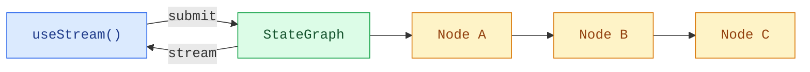

Build frontends that visualize LangGraph pipelines in real time. These patterns show how to render multi-step graph execution with per-node status and streaming content from custom `StateGraph` workflows.

## Architecture

LangGraph graphs are composed of named nodes connected by edges. Each node executes a step (classify, research, analyze, synthesize) and writes output to a specific state key. On the frontend, `useStream` provides reactive access to node outputs, streaming tokens, and graph metadata so you can map each node to a UI card.



```python
from langgraph.graph import StateGraph, MessagesState, START, END

class State(MessagesState):
    classification: str
    research: str
    analysis: str

graph = StateGraph(State)
graph.add_node("classify", classify_node)
graph.add_node("research", research_node)
graph.add_node("analyze", analyze_node)
graph.add_edge(START, "classify")
graph.add_edge("classify", "research")
graph.add_edge("research", "analyze")
graph.add_edge("analyze", END)

app = graph.compile()
```


On the frontend, `useStream` exposes `stream.values` for completed node outputs and `getMessagesMetadata` for identifying which node produced each streaming token.

```ts
import { useStream } from "@langchain/react";

function Pipeline() {
  const stream = useStream<typeof graph>({
    apiUrl: "http://localhost:2024",
    assistantId: "pipeline",
  });

  const classification = stream.values?.classification;
  const research = stream.values?.research;
  const analysis = stream.values?.analysis;
}
```

## Patterns

<CardGroup cols={2}>
  <Card title="Graph execution" icon="chart-dots" href="/oss/python/langgraph/frontend/graph-execution">
    Visualize multi-step graph pipelines with per-node status and streaming content.
  </Card>
</CardGroup>

## Related patterns

The [LangChain frontend patterns](/oss/python/langchain/frontend/overview)—markdown messages, tool calling, optimistic updates, and more—work with any LangGraph graph. The `useStream` hook provides the same core API whether you use `createAgent`, `createDeepAgent`, or a custom `StateGraph`.

---

<div className="source-links">
<Callout icon="edit">
    [Edit this page on GitHub](https://github.com/langchain-ai/docs/edit/main/src/oss/langgraph/frontend/overview.md) or [file an issue](https://github.com/langchain-ai/docs/issues/new/choose).
</Callout>
<Callout icon="terminal-2">
    [Connect these docs](/use-these-docs) to Claude, VSCode, and more via MCP for real-time answers.
</Callout>
</div>
