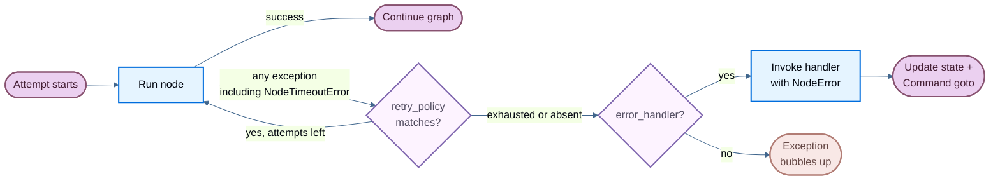

:::python

When a node fails—from a slow external API, a transient network error, or an unhandled exception—LangGraph gives you three composable mechanisms to respond:

- [**Retries**](#retries) — automatically re-run failed attempts based on exception type and backoff settings
- [**Timeouts**](#timeouts) — cap how long a single attempt may run
- [**Error handling**](#error-handling) — run a recovery function after all retries are exhausted

These compose in a fixed order: when a node attempt raises any exception (including @[`NodeTimeoutError`] from a timeout), the retry policy decides whether to retry. Only after retries are exhausted does the error handler run.

For stopping a run cleanly at a superstep boundary and resuming later, see [Graceful shutdown](/oss/langgraph/durable-execution#graceful-shutdown).

<Note>
Per-node timeouts and node-level error handlers require `langgraph>=1.2`, currently in alpha.
</Note>



## Retries

A retry policy automatically re-runs a failed node attempt based on exception type and backoff settings. Pass `retry_policy=` to @[`add_node`]:

```python
from langgraph.types import RetryPolicy

builder.add_node(
    "call_api",
    call_api,
    retry_policy=RetryPolicy(max_attempts=3),
)
```

### Default behavior

By default, `retry_on` uses `default_retry_on`, which retries on **any** exception except the following (and their subclasses):

- `ValueError`
- `TypeError`
- `ArithmeticError`
- `ImportError`
- `LookupError`
- `NameError`
- `SyntaxError`
- `RuntimeError`
- `ReferenceError`
- `StopIteration`
- `StopAsyncIteration`
- `OSError`

For exceptions from popular HTTP libraries such as `requests` and `httpx`, it only retries on 5xx status codes. @[`NodeTimeoutError`] is retryable by default.

### Parameters

| Parameter | Type | Default | Description |
| --------- | ---- | ------- | ----------- |
| `max_attempts` | `int` | `3` | Maximum number of attempts, including the first. |
| `initial_interval` | `float` | `0.5` | Seconds before the first retry. |
| `backoff_factor` | `float` | `2.0` | Multiplier applied to the interval after each retry. |
| `max_interval` | `float` | `128.0` | Maximum seconds between retries. |
| `jitter` | `bool` | `True` | Add random jitter to the interval. |
| `retry_on` | `type[Exception] \| Sequence[type[Exception]] \| Callable[[Exception], bool]` | `default_retry_on` | Exceptions to retry on, or a callable returning `True` for retryable exceptions. |

### Custom retry logic

Pass a callable or exception type to `retry_on`. Import `default_retry_on` to extend the default behavior:

```python
from langgraph.types import RetryPolicy, default_retry_on

def custom_retry_on(exc: BaseException) -> bool:
    if isinstance(exc, MyCustomError):
        return False
    return default_retry_on(exc)

builder.add_node(
    "call_api",
    call_api,
    retry_policy=RetryPolicy(max_attempts=3, retry_on=custom_retry_on),
)
```

### Inspect retry state

Use `runtime.execution_info` inside a node to inspect the current attempt number. This is useful for switching to a fallback when the primary call keeps failing:

```python
from langgraph.graph import StateGraph, START, END
from langgraph.runtime import Runtime
from langgraph.types import RetryPolicy
from typing_extensions import TypedDict

class State(TypedDict):
    result: str

def my_node(state: State, runtime: Runtime) -> State:
    if runtime.execution_info.node_attempt > 1:  # [!code highlight]
        return {"result": call_fallback_api()}
    return {"result": call_primary_api()}

builder = StateGraph(State)
builder.add_node("my_node", my_node, retry_policy=RetryPolicy(max_attempts=3))
builder.add_edge(START, "my_node")
builder.add_edge("my_node", END)
```

`execution_info` exposes the following fields:

| Attribute | Type | Description |
| --------- | ---- | ----------- |
| `node_attempt` | `int` | Current attempt number (1-indexed). `1` on the first try, `2` on the first retry, etc. |
| `node_first_attempt_time` | `float \| None` | Unix timestamp of when the first attempt started. Constant across retries. |
| `thread_id` | `str \| None` | Thread ID for the current execution. `None` without a checkpointer. |
| `run_id` | `str \| None` | Run ID for the current execution. `None` when not provided in config. |
| `checkpoint_id` | `str` | Checkpoint ID for the current execution. |
| `task_id` | `str` | Task ID for the current execution. |

`execution_info` is available even without a retry policy—`node_attempt` defaults to `1`.

## Timeouts

<Note>
Requires `langgraph>=1.2`, currently in alpha.
</Note>

The `timeout=` parameter on @[`add_node`] caps how long a single node attempt may run. Pass a number (seconds), a `timedelta`, or a @[`TimeoutPolicy`] for separate run and idle limits:

```python
from datetime import timedelta
from langgraph.types import TimeoutPolicy

# Simple wall-clock cap
builder.add_node("call_model", call_model, timeout=60)
builder.add_node("call_model", call_model, timeout=timedelta(minutes=2))

# Separate run and idle limits
builder.add_node(
    "call_model",
    call_model,
    timeout=TimeoutPolicy(run_timeout=120, idle_timeout=30),
)
```

<Warning>
Node timeouts only apply to **async** nodes. Sync nodes with a `timeout` are rejected at compile time. To wrap blocking I/O, use `asyncio.to_thread` inside an async node.
</Warning>

### Run timeout

`run_timeout` is a hard wall-clock cap on a single attempt. It is never refreshed, regardless of node activity:

```python
from langgraph.types import TimeoutPolicy

builder.add_node(
    "call_model",
    call_model,
    timeout=TimeoutPolicy(run_timeout=120),
)
```

When the limit is exceeded, LangGraph raises @[`NodeTimeoutError`], clears any writes from the failed attempt, and lets the retry policy decide whether to retry.

### Idle timeout

`idle_timeout` is a progress-resetting cap. It fires only when the node stops making observable progress for the specified duration—unlike `run_timeout`, the clock resets whenever the node produces a progress signal:

```python
builder.add_node(
    "call_model",
    call_model,
    timeout=TimeoutPolicy(idle_timeout=30),
)
```

You can set `run_timeout` and `idle_timeout` together. Whichever fires first cancels the attempt.

#### Progress signals

Under the default `refresh_on="auto"`, the idle clock resets on any of the following:

- State writes via `CONFIG_KEY_SEND`
- Stream output (yielded async stream chunks)
- Child-task scheduling
- Runtime stream-writer calls
- Any LangChain callback event from the node or its descendants (LLM tokens, tool calls, chain start/end, etc.)

#### Heartbeat mode

Set `refresh_on="heartbeat"` to narrow the refresh source to explicit `runtime.heartbeat()` calls only. This is useful when you want a strict idle definition that isn't reset by chatty subordinates:

```python
builder.add_node(
    "call_model",
    call_model,
    timeout=TimeoutPolicy(idle_timeout=30, refresh_on="heartbeat"),
)
```

#### Manual heartbeats

For long-running async work that doesn't naturally emit progress signals, call `runtime.heartbeat()` to manually reset the idle clock:

```python
from langgraph.graph import StateGraph, START, END
from langgraph.runtime import Runtime
from langgraph.types import TimeoutPolicy
from typing_extensions import TypedDict

class State(TypedDict):
    result: str

async def long_running_node(state: State, runtime: Runtime) -> State:
    for batch in fetch_batches():
        process(batch)
        runtime.heartbeat()  # [!code highlight]
    return {"result": "done"}

builder = StateGraph(State)
builder.add_node(
    "long_running_node",
    long_running_node,
    timeout=TimeoutPolicy(idle_timeout=30, refresh_on="heartbeat"),
)
builder.add_edge(START, "long_running_node")
builder.add_edge("long_running_node", END)
```

`runtime.heartbeat()` is a no-op outside an idle-timed attempt, so you can call it unconditionally.

### NodeTimeoutError

When a timeout fires, LangGraph raises @[`NodeTimeoutError`] with structured context about which limit was hit:

| Attribute | Type | Description |
| --------- | ---- | ----------- |
| `node` | `str` | Name of the node whose execution timed out. |
| `elapsed` | `float` | Seconds elapsed before the timeout fired. |
| `kind` | `Literal["idle", "run"]` | Which timeout fired. |
| `idle_timeout` | `float \| None` | The configured idle timeout (seconds), if any. |
| `run_timeout` | `float \| None` | The configured run timeout (seconds), if any. |

`NodeTimeoutError` is retryable by default. Combining `timeout=` with `retry_policy=` works out of the box—the timeout clock resets on each new attempt, and writes from a timed-out attempt are cleared before the next retry:

```python
from langgraph.types import RetryPolicy, TimeoutPolicy

builder.add_node(
    "call_model",
    call_model,
    timeout=TimeoutPolicy(idle_timeout=30),
    retry_policy=RetryPolicy(max_attempts=3),
)
```

### Dynamic timeouts with Send

When using @[`Send`] to dispatch nodes dynamically (for example, in map-reduce patterns), you can pass a `timeout=` directly on the `Send` to override the target node's static timeout for that specific push:

```python
from langgraph.types import Send, TimeoutPolicy

def fan_out(state: OverallState):
    return [
        Send("process_item", {"item": item}, timeout=TimeoutPolicy(idle_timeout=15))
        for item in state["items"]
    ]
```

If `timeout=` is omitted on the `Send`, the target node's timeout (set at `add_node` time) applies. This lets you set a default timeout on the node and tighten it for individual calls.

## Error handling

<Note>
Requires `langgraph>=1.2`, currently in alpha.
</Note>

An error handler runs after a node fails and all retries are exhausted. It receives the current state and can update it or route to a different node using @[`Command`]. This is useful for compensation flows (Saga patterns) where you want to recover gracefully rather than abort the entire graph.

Pass `error_handler=` to @[`add_node`]:

```python
from langgraph.errors import NodeError
from langgraph.types import Command, RetryPolicy
from langgraph.graph import StateGraph, START
from typing_extensions import TypedDict

class State(TypedDict):
    status: str

def charge_payment(state: State) -> State:
    raise RuntimeError("payment gateway timeout")

def payment_error_handler(state: State, error: NodeError) -> Command:
    return Command(
        update={"status": f"compensated: {error.error}"},
        goto="finalize",
    )

def finalize(state: State) -> State:
    return state

graph = (
    StateGraph(State)
    .add_node(
        "charge_payment",
        charge_payment,
        retry_policy=RetryPolicy(max_attempts=3, retry_on=ConnectionError),
        error_handler=payment_error_handler,
    )
    .add_node("finalize", finalize)
    .add_edge(START, "charge_payment")
    .compile()
)
```

The handler fires only after `retry_policy` is exhausted, or immediately if no retry policy is configured. The retry policy and the error handler stay decoupled: configure when to retry and when to compensate independently.

### NodeError

Error handlers receive failure context through a typed `error: NodeError` parameter, injected by type annotation (the same pattern as `runtime: Runtime`):

```python
from langgraph.errors import NodeError

def my_handler(state: State, error: NodeError) -> Command:
    print(f"Node {error.node} failed with: {error.error}")
    return Command(update={"status": "recovered"}, goto="next_step")
```

@[`NodeError`] is a frozen dataclass with two fields:

| Attribute | Type | Description |
| --------- | ---- | ----------- |
| `node` | `str` | Name of the node whose execution failed. |
| `error` | `BaseException` | The exception raised by the failed node. |

The `error: NodeError` parameter is opt-in. Handlers that don't need failure context can use simpler signatures like `(state)` or `(state, runtime)`.

### Route with Command

Error handlers can return a @[`Command`] to update state and route to a specific node, enabling Saga / compensation patterns:

```python
from langgraph.errors import NodeError
from langgraph.types import Command, RetryPolicy
from langgraph.graph import StateGraph, START
from typing_extensions import TypedDict

class State(TypedDict):
    status: str

def reserve_inventory(state: State) -> State:
    return {"status": "reserved"}

def charge_payment(state: State) -> State:
    raise RuntimeError("payment timeout")

def payment_error_handler(state: State, error: NodeError) -> Command:
    return Command(
        update={"status": f"compensated_after_{error.node}: {error.error}"},
        goto="finalize",
    )

def finalize(state: State) -> State:
    return state

graph = (
    StateGraph(State)
    .add_node("reserve_inventory", reserve_inventory)
    .add_node(
        "charge_payment",
        charge_payment,
        retry_policy=RetryPolicy(max_attempts=3, retry_on=ConnectionError),
        error_handler=payment_error_handler,
    )
    .add_node("finalize", finalize)
    .add_edge(START, "reserve_inventory")
    .add_edge("reserve_inventory", "charge_payment")
    .compile()
)
```

`charge_payment` retries on `ConnectionError` up to 3 times. If retries are exhausted (or the error isn't a `ConnectionError`), the handler compensates by updating state and routing to `finalize` instead of aborting the graph.

### Resume-safe failures

<Note>
Failure provenance is checkpointed. If the graph is interrupted or the process crashes after a node fails but before the handler completes, the handler sees the same `NodeError` context when the graph resumes from its checkpoint.
</Note>

### Behavior with `interrupt()`

<Warning>
`interrupt()` raised inside a node is **not** routed to the error handler. Interrupts use the `GraphBubbleUp` mechanism to pause graph execution for human-in-the-loop workflows, bypassing both retry policies and error handlers. The graph pauses as usual.
</Warning>

### Subgraph failures

If a node wraps a subgraph and the subgraph raises an unhandled exception, that exception surfaces to the parent node. If the parent node has an `error_handler`, the handler fires with the subgraph's exception in `error.error`.

## Functional API

The same `timeout=` and `retry_policy=` parameters are available on `@task` and `@entrypoint` in the functional API:

```python
from langgraph.func import entrypoint, task
from langgraph.types import RetryPolicy, TimeoutPolicy

@task(
    timeout=TimeoutPolicy(idle_timeout=30),
    retry_policy=RetryPolicy(max_attempts=3),
)
async def call_api(url: str) -> str:
    response = await fetch(url)
    return response.text

@entrypoint(timeout=60)
async def my_workflow(inputs: dict) -> str:
    result = await call_api("https://api.example.com/data")
    return result
```

The behavior is identical to `add_node`: `NodeTimeoutError` is raised on timeout, buffered writes are cleared, and the retry policy decides whether to retry.

## Limitations

- **Python only**: timeouts and error handlers are not available in the JavaScript/TypeScript SDK. Retry policies work in both Python and TypeScript.
- **Timeouts are async-only**: sync nodes with a `timeout` are rejected at compile time.
- **One handler per node**: each node can have at most one `error_handler`.
- **Handler failures bubble up**: if the error handler itself raises, that exception propagates as if the node had no handler.

:::
